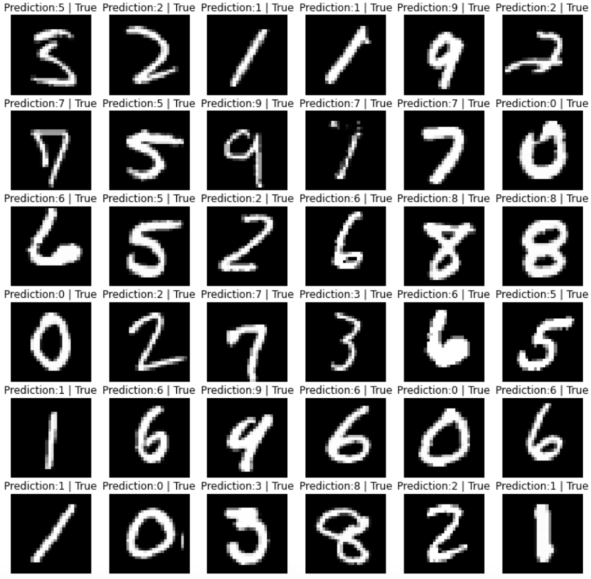

# Convolutional Neural Network (CNN) from scratch

This is a fully NumPy-based CNN model with PyTorch-style APIs. I tried to replicate some functions in the torch library like nn.Sequential, nn.Conv2d and a naive version of Autograd engine. You might find some of the expressions in this programme quite familiar. Btw my favourite one is loss.backward() :)

### Example usage

I used this library to build a LeNet, and trained with MNIST datasets. (Note that I replaced the sigmoid in the original LeNet with ReLU, and used MaxPooling rather than AveragePooling. Other model specs are completely the same.)

```python
model = Sequential(
    Conv2d(in_channels=1, out_channels=6, kernel_size=5, stride=1, padding=2),
    ReLU(),
    MaxPool2d(kernel_size=2, stride=2),
    Conv2d(in_channels=6, out_channels=16, kernel_size=5, stride=1, padding=0),
    ReLU(),
    MaxPool2d(kernel_size=2, stride=2),
    Flatten(),
    Linear(400, 120),
    ReLU(),
    Linear(120, 84),
    ReLU(),
    Linear(84, 10),
    )
```
Training this model for 1 epoch takes roughly 7 minutes on my Apple M1 chip, while training an equivalent model using PyTorch takes 20 seconds. 

### Perform forward and backward pass

```python
# forward
loss = Cross_entropy(model, images, labels)

# backward
loss.backward()
```
### Classify MNIST images with trained model



